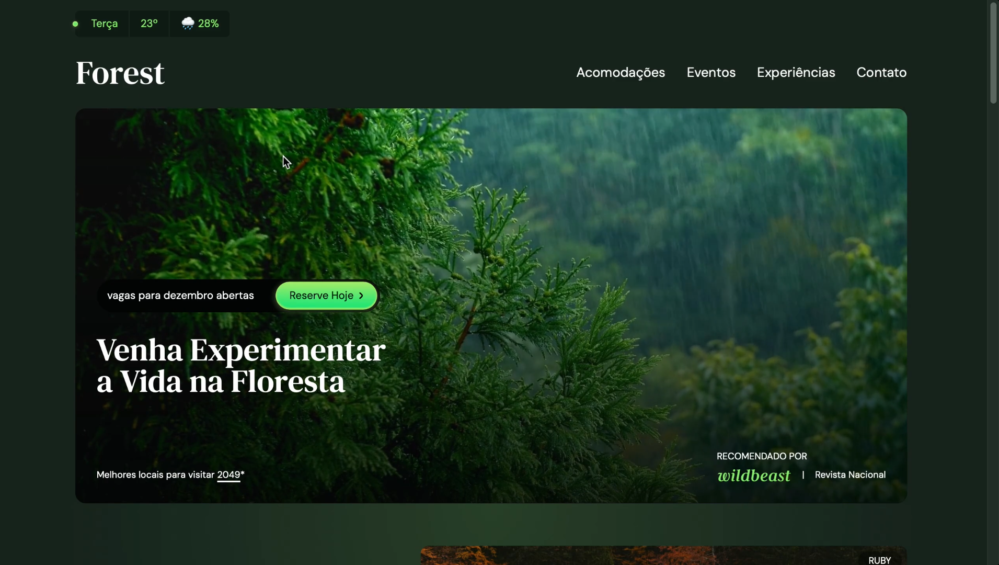

<h1 align="center">🌲 Forest - Rental Houses in the Woods</h1>  

Landing page project where users can explore and rent houses in the heart of the forest. Built as part of the Origamid course, focusing on a clean, modern, and responsive design.
  

  
    
    
    

  

## 🔗 Live Demo  

  

## ✨ Features  
✔️ Elegant and minimalist UI  
✔️ Fully responsive design  
✔️ Smooth user experience  

## 🛠 Tech Stack  
- **HTML & JavaScript** for structure and interactivity  
- **Tailwind CSS** for styling and responsiveness  

🚀 This project is a learning experience and showcases best practices in **UI/UX design**.  
